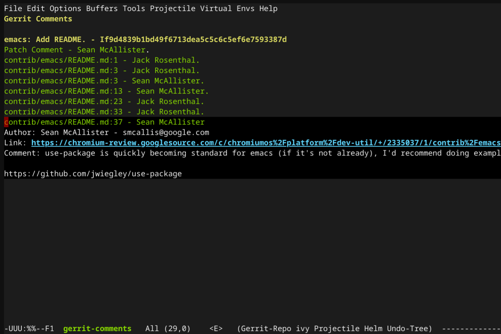
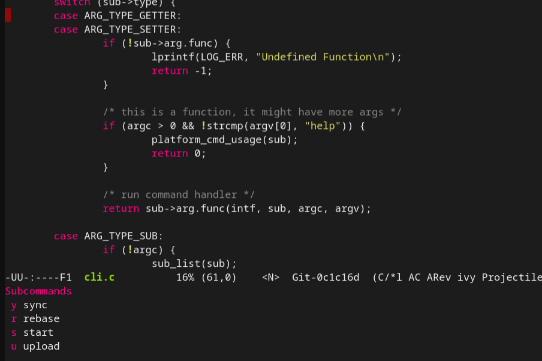
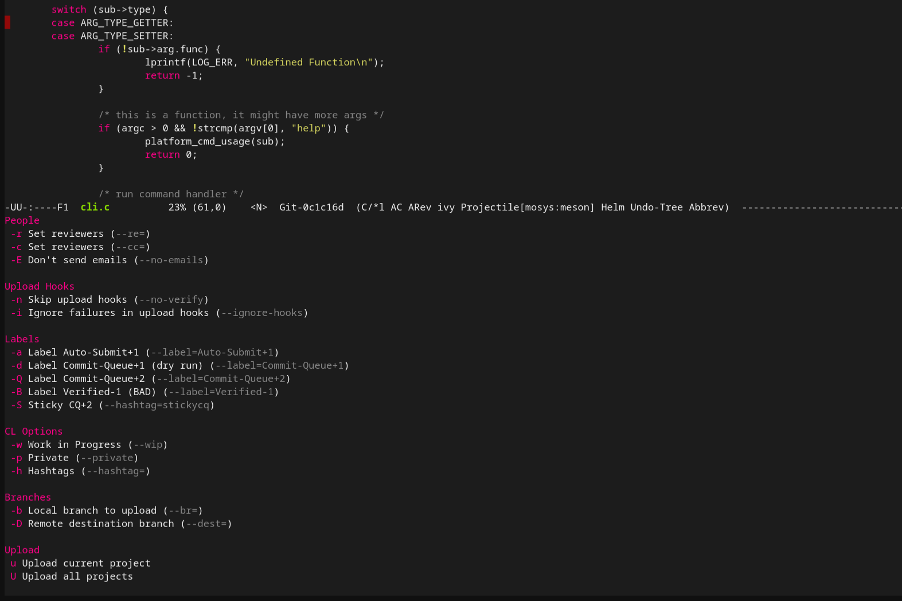

# Chromacs - Repo, Gerrit, & Emacs

Chromacs is an Emacs extension for the integration of workflows with the Repo
tool & Gerrit into Emacs.  This project is WIP and is currently focused on
delivering better Emacs-Gerrit integration.


## Installation

Requirements:

* libcurl
* request.el
* magit

Clone ChromiumOS dev-util codebase:

```shell
git clone https://chromium.googlesource.com/chromiumos/platform/dev-util
```


Add the following to your `init.el` script.

```lisp
(add-to-list 'load-path
  "{ABSOLUTE_PATH_TO_DIR_WITH_CLONE}/dev/contrib/emacs/")

(use-package gerrit :ensure nil)
(use-package gerrit-section :ensure nil)
(use-package repo-transient: ensure nil)

(setq gerrit-repo-root
  "{ABSOLUTE_PATH_TO_REPO_ROOT}")

;; These could be any number of different hosts.
(setq gerrit-hosts
  '( "chrome-internal-review.googlesource.com"
  "chromium-review.googlesource.com"))

(gerrit-init)
```

## Usage

Invoking the `gerrit-comments` command will show a buffer wiith changes that
contain comments on recent CLs.  The buffer is similar to any `magit` style
buffer, with the same navigation key bindings, see
[magit-section](https://magit.vc/manual/magit.html#Sections).

Every highlighted filepath is also a button that navigates you to the location
under comment.

The comments can be refreshed at any point by invoking `gerrit-refresh`.



### Repo Menu

*** note
**Note:** This is still an experimental feature.  In particular, `repo start` is not
fully working yet.
***

Invoke the `repo-main-menu` command.


Enter the main menu.




Try uploading a CL





## Feedback & Questions

Any questions or feedback is greatly appreciated!

[Chromacs Group](https://groups.google.com/a/google.com/g/repo-gerrit)
